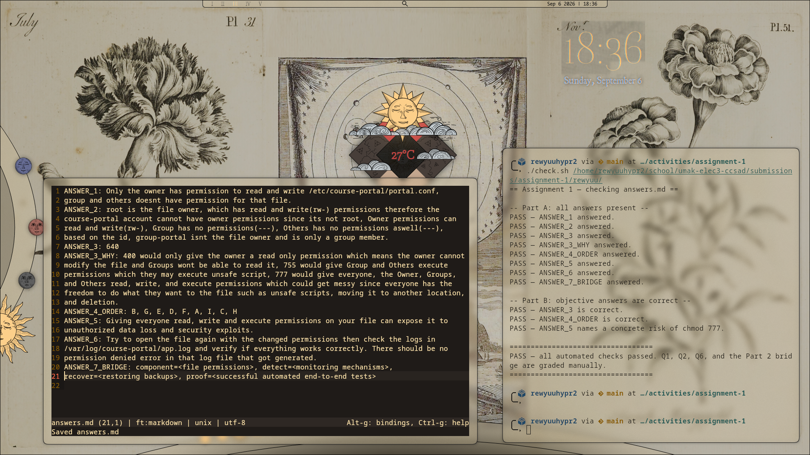

## Activity

Activity ID (e.g. `seatwork-1`, `lab-1`): `assignment-1`
Brief used (Lab Activity 1 only): N/A

## Screenshots




## Evidence

Paste your `check.sh` output showing `PASS`:

```
== Assignment 1 — checking answers.md ==

-- Part A: all answers present --
PASS — ANSWER_1 answered.
PASS — ANSWER_2 answered.
PASS — ANSWER_3 answered.
PASS — ANSWER_3_WHY answered.
PASS — ANSWER_4_ORDER answered.
PASS — ANSWER_5 answered.
PASS — ANSWER_6 answered.
PASS — ANSWER_7_BRIDGE answered.

-- Part B: objective answers are correct --
PASS — ANSWER_3 is correct.
PASS — ANSWER_4_ORDER is correct.
PASS — ANSWER_5 names a concrete risk of chmod 777.

==================================
PASS — all automated checks passed. Q1, Q2, Q6, and the Part 2 bridge are graded manually.
==================================
```

## Checklist

- [x] All group members (if applicable) worked on this submission.
- [x] This only adds files inside our own folder under `submissions/`.
