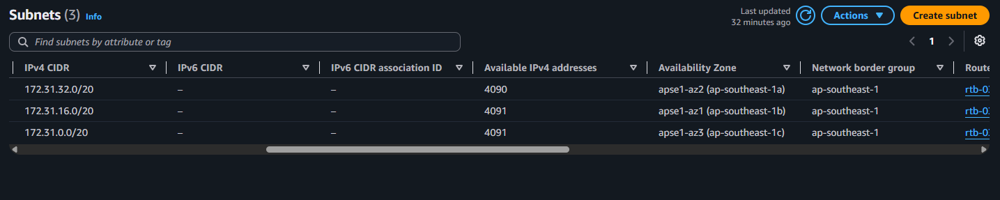
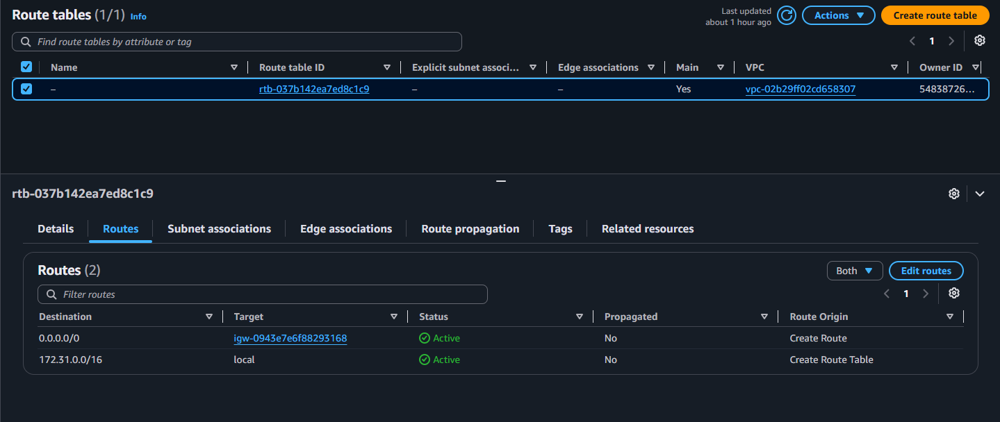
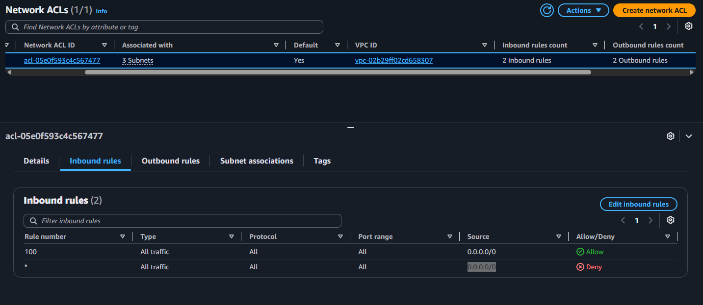
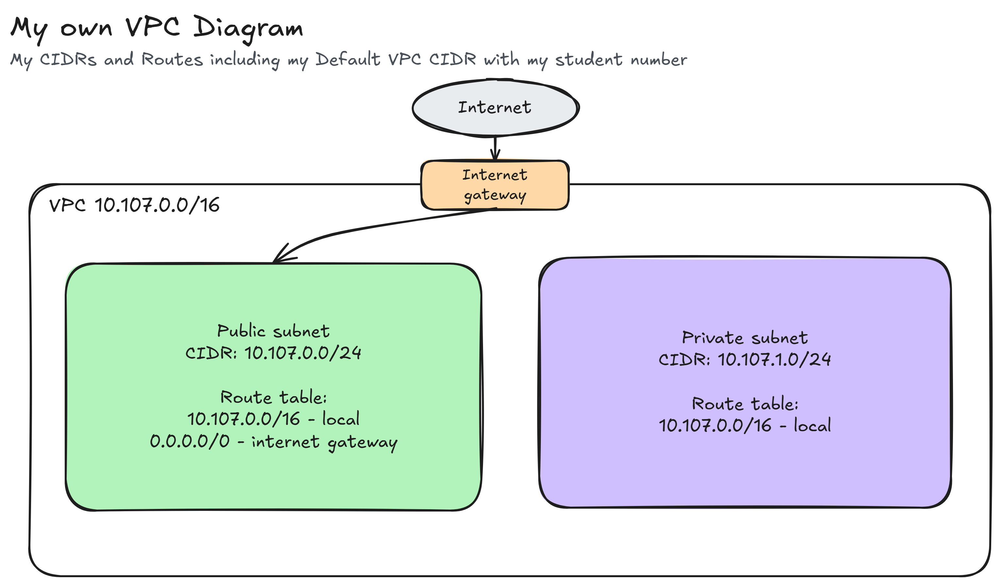

# Assignment 2 Submission

<!--
How to use this template:

1. Copy this file to submissions/assignment-2/<your-github-username>/submission.md
2. Replace every answer placeholder with your own answer. Delete the angle brackets too.
3. Save your four images in the same folder, with the exact file names below.
4. Do not write your full name or your student number in this file.
-->

## About me

- GitHub username: rewyuu
- Section: IV - CCSAD
- IAM user name that I signed in with: ccsad-g07
- X: 107

---

## Part A. Explore

### A1. The VPC

Default VPC IPv4 CIDR:

172.31.0.0/16

Number of addresses in that CIDR:

65,536

### A2. The subnets

| Availability Zone | IPv4 CIDR |
| --- | --- |
| apse1-az2 (ap-southeast-1a) | 172.31.32.0/20 |
| apse1-az1 (ap-southeast-1b) | 172.31.16.0/20 |
| apse1-az3 (ap-southeast-1c) | 172.31.0.0/20 |

Screenshot 1. Save it as `screenshot-1-subnets.png` in your folder. The image line below shows it.

### A3. Available addresses

Available IPv4 addresses in each subnet:

apse1-az2 (ap-southeast-1a): 4090
apse1-az1 (ap-southeast-1b): 4091
apse1-az3 (ap-southeast-1c): 4091

Why is the number lower than 4,096?

In the current subnet, there are only a maximum of 4096 IP addresses and 5 of them are reserved for every subnet that AWS keeps for itself.

What uses the missing address in the subnet with the lowest number?

apse1-az2 (ap-southeast-1a) has one less ip address, therefore it means that an active AWS service, resource, or internal mapping is currently occupying an extra address in that specific availability zone.

### A4. The route table

| Destination | Target |
| --- | --- |
| 0.0.0.0/0 | igw-0943e7e6f88293168 |
| 172.31.0.0/16 | local |

Screenshot 2. Save it as `screenshot-2-routes.png` in your folder. The image line below shows it.

### A5. Public or private

Are the default subnets public or private? Which route proves it?

Any subnet with a route directing all traffic (0.0.0.0/0) to an Internet Gateway is a public subnet because it enables resources within that subnet to send and receive traffic directly from the internet.

### A6. The internet gateway

State of the internet gateway:

Attached

What happens to the default subnets if the gateway is detached?

If an Internet Gateway is detached from the VPC, the default subnets instantly become private subnets.

### A7. NAT gateways

Number of NAT gateways:

0

Can a server in a new private subnet download updates? Why?

A private subnet has no route to an Internet Gateway (igw). Because its route table only contains the local VPC route (172.31.0.0/16), any outbound traffic destined for the public internet is dropped. Without internet access, the server cannot reach software repositories or update servers.

### A8. The network ACL

| Rule number | Source | Allow or Deny |
| --- | --- | --- |
| 100 | 0.0.0.0/0 | Allow |
| * | 0.0.0.0/0 | Deny |

How is a network ACL different from a security group?

A network ACL acts as a stateless, subnet-level firewall that evaluates numbered rules sequentially, whereas a security group acts as a stateful, instance-level firewall that automatically permits return traffic.

Screenshot 3. Save it as `screenshot-3-network-acl.png` in your folder. The image line below shows it.

### A9. The default security group

Inbound rule (type and source):

Type: All traffic
Source: sg-0c5b6d4081cf0a534 / default

Which resources can send traffic to an instance that uses it?

Any resource (such as an EC2 instance or another network interface) associated with the same security group (default) within that VPC can send traffic to the instance.

---

## Part B. Prepare

### B1. Plan two subnets

Default VPC CIDR: 10.107.0.0/16

- Public subnet CIDR: 10.107.0.0/24
- Private subnet CIDR: 10.107.1.0/24

### B2. Route tables

Route table of the public subnet:

| Destination | Target |
| --- | --- |
| 10.107.0.0/16 | local |
| 0.0.0.0/0 | internet gateway |

Route table of the private subnet:

| Destination | Target |
| --- | --- |
| 10.107.0.0/16 | local |

### B3. My VPC diagram

Tool used (Excalidraw, draw.io, Lucidchart, or paper):

Excalidraw

Save your diagram as `vpc-diagram.png` in your folder. The image line below shows it.

### B4. Predict a change

Can you still open the web page from your laptop? Why?

No, because deleting 0,0,0,0/0 removes the route to the Internet Gateway, preventing external HTTP/HTTPS traffic from reaching or returning to your laptop.

Can the instance still reach another instance in the VPC? Why?

Yes, because intra-VPC traffic uses 10.x.0.0/16 to local route, which remains active regardless of internet routes.

### B5. Place a database

Which subnet gets the database? Why?

Place it in the private subnet 10.107.1.0/24 to isolate it from direct public internet access while allowing web application servers inside the VPC to access it locally.

### B6. My question about VPCs

What is your question, and what made you think of it?

How risky is it to deploy a web server that wasnt configured yet like no security or ACL for prototyping / testing, I thought about it when I wondered about real-world scenarios where developers deploy server infrastructure early during testing, leaving public IP addresses and ports exposed before the web application is actually ready for use.
